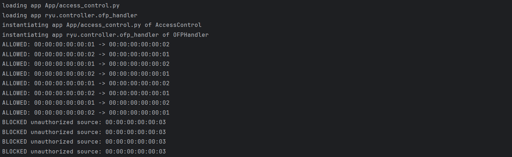
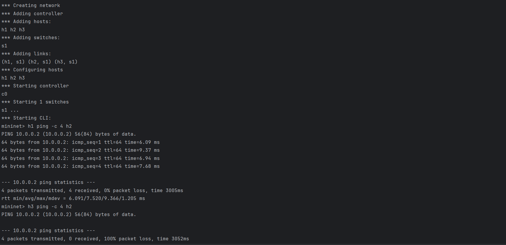
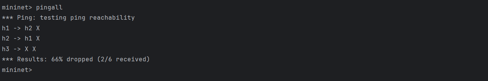
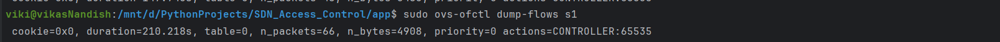

# SDN Access Control Project

## Problem Statement

This project implements a Software Defined Networking (SDN) based access control system using Ryu Controller and Mininet.
The objective is to allow communication only between authorized hosts and block unauthorized hosts based on MAC address policies.

---

## Objective

To demonstrate:

* Controller-switch interaction in SDN
* OpenFlow match-action flow rule design
* Packet filtering and access control enforcement

---

## Tools & Technologies Used

* Python 3.8
* Ryu SDN Controller
* Mininet Network Emulator
* OpenFlow 1.3
* Ubuntu (WSL)
* PyCharm

---

## Project Structure

```bash
SDN_Access_Control/
│
├── App/
│   ├── access_control.py
│   ├── topo.py
│
├── screenshots/
│   ├── ryu_running.png
│   ├── mininet_test.png
│   ├── pingall_result.png
│   ├── flow_table.png
│
├── .gitignore
└── README.md
```

---

## Network Topology

This project uses:

* 1 Switch: s1
* 3 Hosts:

  * h1
  * h2
  * h3

### Access Policy:

* h1 and h2 are authorized hosts
* h3 is unauthorized
* Only h1 ↔ h2 communication is allowed

---

## Installation Commands

### Install Python Dependencies

```bash
pip install ryu==4.34 eventlet==0.30.2 flask
```

### Install Mininet in Ubuntu

```bash
sudo apt update
sudo apt install mininet -y
sudo apt install openvswitch-switch -y
```

### Verify Mininet Installation

```bash
mn --version
```

---

## How to Run the Project

### Step 1: Start Ryu Controller

Run in Windows / PyCharm terminal:

```bash
python -m ryu.cmd.manager --ofp-listen-host 0.0.0.0 App/access_control.py
```

---

### Step 2: Start Mininet Topology

Run in Ubuntu / WSL terminal:

```bash
cd /mnt/d/PythonProjects/SDN_Access_Control/App
sudo mn -c
sudo mn --custom topo.py --topo mytopo --controller=remote,ip=172.27.80.1,port=6633
```

> Replace IP with your actual Windows host IP if different.

---

### Step 3: Test Allowed Communication

```bash
h1 ping -c 4 h2
```

Expected:

* Successful ping
* 0% packet loss

---

### Step 4: Test Blocked Communication

```bash
h3 ping -c 4 h2
```

Expected:

* Access denied
* 100% packet loss

---

### Step 5: Test Full Connectivity

```bash
pingall
```

Expected:

```bash
*** Results: 66% dropped (2/6 received)
```

---

### Step 6: View OpenFlow Flow Table

Run in Ubuntu terminal:

```bash
sudo ovs-ofctl dump-flows s1
```

---

### Step 7: Cleanup Mininet

```bash
sudo mn -c
```

---

## Expected Output Summary

### Allowed:

```bash
h1 → h2 ✓
h2 → h1 ✓
```

### Blocked:

```bash
h1 → h3 ✗
h2 → h3 ✗
h3 → h1 ✗
h3 → h2 ✗
```

---

## Features Implemented

* MAC-based host authorization
* Allowed communication pair filtering
* Unauthorized host blocking
* ARP packet handling
* Dynamic MAC learning
* OpenFlow flow rule installation

---

## Proof of Execution

### 1. Ryu Controller Running

Paste screenshot below:




---

### 2. Mininet Topology + Ping Test

Paste screenshot below:



---

### 3. pingall Output

Paste screenshot below:



---

### 4. OpenFlow Flow Table

Paste screenshot below:



---

## Sample Validation Results

### Allowed Test:

```bash
mininet> h1 ping -c 4 h2
4 packets transmitted, 4 received, 0% packet loss
```

### Blocked Test:

```bash
mininet> h3 ping -c 4 h2
4 packets transmitted, 0 received, 100% packet loss
```

---

## Commands Summary

### Start Controller

```bash
python -m ryu.cmd.manager --ofp-listen-host 0.0.0.0 App/access_control.py
```

### Start Mininet

```bash
sudo mn --custom topo.py --topo mytopo --controller=remote,ip=172.27.80.1,port=6633
```

### Test Ping

```bash
h1 ping -c 4 h2
h3 ping -c 4 h2
pingall
```

### Dump Flow Rules

```bash
sudo ovs-ofctl dump-flows s1
```

---

## References

* Mininet Documentation: https://mininet.org/
* Ryu Documentation: https://ryu.readthedocs.io/
* OpenFlow Specification
* PES University SDN Project Guidelines

---

## Author

Vikas N ,
B.Tech CSE
